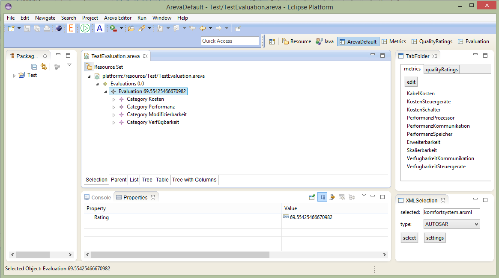
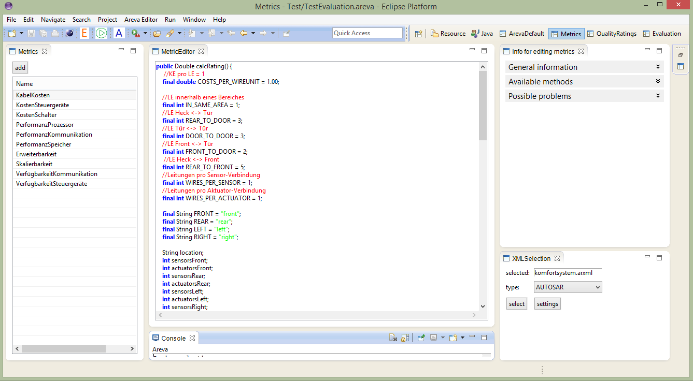
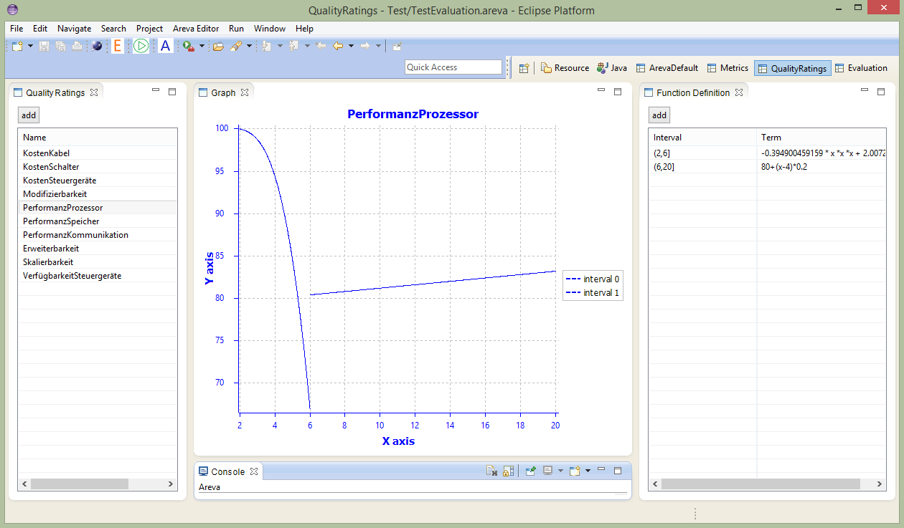
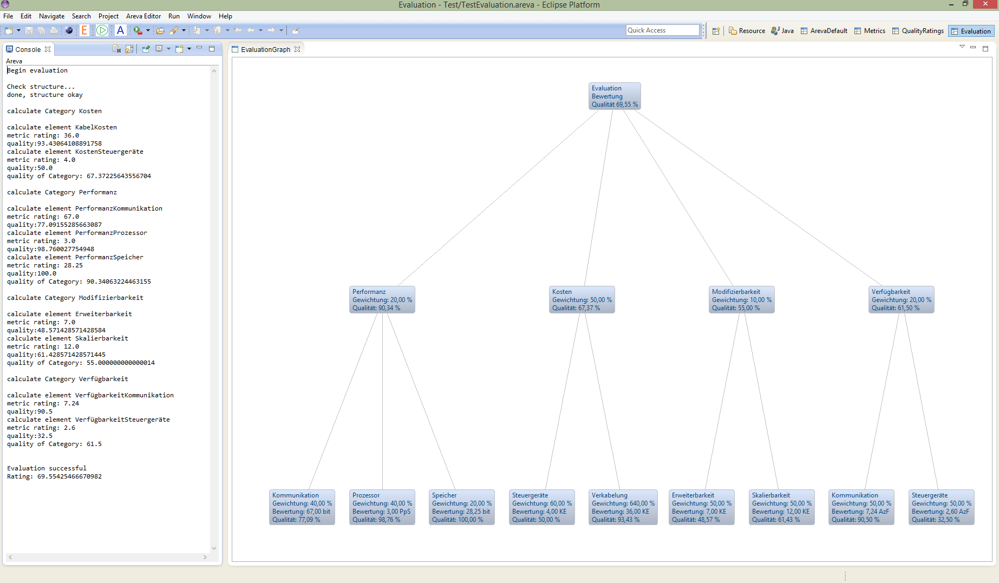

# AREva
AREva - A toolset for *A*rchitecture *R*elation *Eva*luation and optimisation

## Idea, Origin, State and on-going Work
This EMF-based prototypical tool implements a theoretical framework for the evaluation of architecture relations, proposed in the PhD thesis of L. Maertin. The original implementation, AREva, was originally developed as Java application in course of the diploma thesis of L. Märtin in 2009 on basis of the concepts in the PhD thesis of B. Florentz. 

Originally AREva enables automated evaluations and analyses of software/hardware architectures for AUTOSAR systems. Architectures are imported and validated towards the fulfilment of a finite set of quality attributes. For that, the user describes the hierarchical order of that attributes and define metrics and conversions to qualities (values to %). At least, AREva checks violations of lower bounds for all qualities and aggregates the overall quality of an architectural design.  In addition, the tool supports the analysis of the distance relations between the distribution of computational resources and software components mapped to them.

S. v. Höveling started the development of the new EMF-implementation in 2014/15 as master student assistant for the TU Braunschweig (Institute for Programming and Reactive Systems). This re-development was scratched and supervised by L. Märtin. It was implemented as EMF project to make use of established plugins for meta-modelling and visualisation. In particular, the new version of AREva enables the use of the tool in combination with the Palladio Bench modelling tool (www.palladio-simulator.com) to import architectures in the Palladio Component Model format. Aside with the Palladio extension PerOpteryx (https://sdqweb.ipd.kit.edu/wiki/PerOpteryx) the generation and evaluation of a set of variations from a base architecture is possible. Here, AREva supports the user to figure out the best-fitting variation, automated derived by the evaluation structure (Trade-off determination). 

The on-going development and the further integration of the tool chain are done in course of his PhD thesis of L. Märtin. In particular, the relations between variants and the post-processing of evaluation results are inspected here to use that additional knowledge from design time to support reconfiguration decisions at run time.  At the moment the results from the architecture evaluation are analysed by hand.

Multi-mode support in course of the Bachelor thesis of Nils-André Forjahns. (Details following...)

In addition to Palladio Bench and Palladio DSE/PerOpteryx, AREva makes use of several libraries: Opt4J, Zest and ... (list to be completed).

## Features
The current alpha version of the AReva toolset supports:
- Definition of the evaluation tree structure
  - Hierarchical ordering
  -	Weightings
  - Worst case acceptance values
  -	Mapping to metrics and quality rates
-	Graphical representation of the evaluation structure
  -	Tree-based w/o cross-cutting constraints
  -	Partial highlighting of results and violations
-	Definition of metrics
  -	Java-Code
  -	Templates for frequently queries on the architecture 
  -	Syntax highlighting
-	Definition of Quality Rates
  -	Mathematical functions with intervals
  -	Tables for discrete value conversion
  -	Graphical representation of the functions
-	Architecture importers
  -	Automotive architectures in ARXML-format
  -	Architectures of the Palladio Component Model
- Multi-mode support for ...

## Screenshots of the Alpha Release

Evaluation Structure Editor:

Evaluation Metric Editor

Evaluation Quality Rate Editor

Evaluation Result and Visusalisation:

