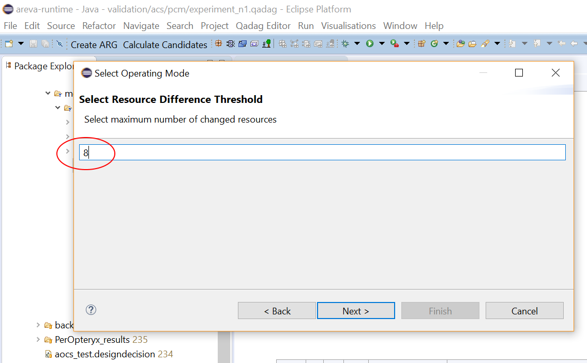
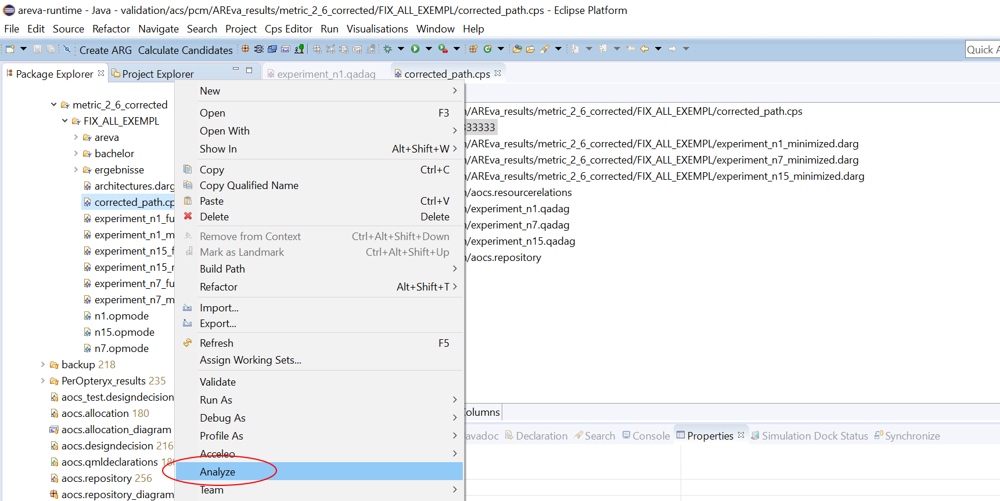

# AREva
AREva - A toolset for *A*rchitecture *R*elation *Eva*luation

## Description
AREva is a software toolset to analyse variable systems for multi-purpose settings and its reactions on anticipated hardware failures. It was developed to support system architects in finding optimal mission orders for the system to execute by analysing it for a plethora of metrics as well as injecting faults. 

It is implemented as a collection of eclipse plugins that also include modified versions of the [Palladio Bench](http://www.palladio-simulator.com/) modeling tool for modeling the system, and its plugin [PerOpteryx](https://sdqweb.ipd.kit.edu/wiki/PerOpteryx) that generates possible system configurations using different redundant hardware.

## Background
Modern dependable systems like Satellites rely on redundant hardware platforms to execute predefined missions in hostile environments. Different missions have different requirements on the system, which can be described as quality criteria. Finding optimal system configurations that fullfil these criteria as best as possible, keep the recofiguration cost low, are as fault tolerant as possible while also finding optimal mission orders that guarantee the best possible outcome is challenging. AREva has been developed to support system architects to find these answers based on metrics, quality and fault analysis on the system.

## Idea, Origin, State and on-going Work
This EMF-based prototypical toolset implements a theoretical framework for the evaluation of architecture relations, proposed in the PhD thesis of L. Maertin. 

The original implementation, AREva, was originally developed as Java application in course of the diploma thesis of L. Märtin in 2009 on basis of the concepts in the PhD thesis of B. Florentz. At this time, AREva enabled automated evaluations and analyses of software/hardware architectures for AUTOSAR systems. Architectures were imported and validated towards the fulfillment of a finite set of quality attributes. For that, the user described the hierarchical order of that attributes and defined metrics and conversions to qualities (values to %). At least, AREva checked violations of lower bounds for all qualities and aggregates the overall quality of an architectural design. In addition, the tool supported the analysis of the distance relations between the distribution of computational resources and software components mapped to them.

The re-development was scratched and supervised by L. Märtin. S. v. Höveling started the development of the new EMF-implementation in 2014/15 as master student assistant for the TU Braunschweig (Institute for Programming and Reactive Systems, IPS). It was implemented as EMF project to make use of established plugins for meta-modelling and visualisation. In particular, the new version of AREva enables the use of the tool in combination with the [Palladio Bench](http://www.palladio-simulator.com/) modelling tool to import architectures in the Palladio Component Model format. Aside with the Palladio extension [PerOpteryx](https://sdqweb.ipd.kit.edu/wiki/PerOpteryx) the generation and evaluation of a set of variations from a base architecture is possible. Here, AREva supports the user to figure out the best-fitting variation, automated derived by the evaluation structure (Trade-off determination). The evaluation structure is now capable to describe the quality demands of an operational mode with weightings and minimal acceptance values. However, the user has to post-process the results from the architecture evaluation by hand.

The on-going development and the further integration of the tool chain are done by L. Märtin and N.-A. Forjahn as bachelor student assistant at IPS. In particular, the relations between variants and the post-processing of evaluation results are inspected here to use that additional knowledge from design time to support reconfiguration decisions at run time. The tool is extended as expert system to support maintenance of dependable systems. The gathered date is post-processed by the tool an structured by several export files (result.xml for reconfiguration paths, several csv for graph-wide data, ...) to provide rationales for reconfigration decisions.

The third extension of AREva was done in course of the bachelor thesis of N.-A. Forjahn. The thesis is about to support multi-purpose scenarios with varying operational mode of a system. Thus, the quality demands a no longer fixed, but several can be defined. The refined implementation of AREva is now capable to (1) support the analysis of multiple modes, (2) figure out commonalities between nodes for best transition locations in graphs and (3) deliver an optimal order of modes for the life cycle of the sytem.

## Features
The current version of the AReva toolset supports:
- Definition of the evaluation tree structure
  - Hierarchical ordering
  -	Weightings
  - Worst case acceptance values
  -	Mapping to metrics and quality rates
-	Graphical representation of the evaluation structure
  -	Tree-based w/o cross-cutting constraints
  -	Partial highlighting of results and violations
-	Definition of metrics
  -	Java-Code
  -	Templates for frequently queries on the architecture 
  -	Syntax highlighting
-	Definition of Quality Rates
  -	Mathematical functions with intervals
  -	Tables for discrete value conversion
  -	Graphical representation of the functions
-	Architecture importers
  -	Automotive architectures in ARXML-format
  -	Architectures of the Palladio Component Model
- Multi-mode support
  - Batch-processing of analyses for several operation mode
  - Derivation of optimal transition configurations
  - Optimal Mode Sequencing

## Toolchain
In [Palladio Bench](http://www.palladio-simulator.com/) the system is being modeled into Design and Analysis models.
Variation is achieved by setting up Degrees of Freedom in [PerOpteryx](https://sdqweb.ipd.kit.edu/wiki/PerOpteryx) that connects additional system components to selected ones to be replaced in candidates.
Those generated candidates are then analysed by Areva.  

## Functionality
Areva consists of an internal, multistep toolchain, as seen in the figure below. The main steps are creating its own datasets based on [PerOpteryx's](https://sdqweb.ipd.kit.edu/wiki/PerOpteryx) output candidates, minimizing them based on all operating mode quality criterias, and analyzing all system variants for selected metrics and fault tolerance.

### Creating an ARG Instance
The first step of Areva is creating an ARG instance. ARG stands for "**A**rchitecture **R**elations **G**raph" and is a model representation of all architecture candidate variations that have been produced by PerOpteryx. Each one consists of all its used resources and its associated quality value for each defined quality criteria. These are
  
* Lifetime
* Noise
* Torque
* Accurary
* Pointing Time
* Power Consumption

### Minimize ARG and Create DARG
The next step **Minimize** is weighting these quality criteria for each architecture with QADAG instances and minimize their interconnectivity, resulting in a DARG. QADAG stands for "**Q**uality **A**ttribute **D**eterminisation **A**rchitecture **G**raph" and each of them represents an operating mode of the system, which has been derived from a given mission or experiment description. So, for each mission the system is going to switch to in its lifetime, one QADAG representing it has to be created, as seen in the figure below.

Internally a QADAG is a tree structure containing all defined quality criteria as leafs, with a root node holding all of them. Each leaf has a weight and an optional minimum value assigned to it. The weight translates to how important the quality criteria is for the mission, while the minimum value filters architectures that are just not good enough to fullfil certain mission requirements, even if they excel in other criteria. So, for example, if a mission is carried out over several months or even years a high Lifetime of the system is important. That would not only result in a high Lifetime weight but also in setting up a minimum value of several months, so the system is guaranteed to run a certain amount of time. Weighting and summing up all quality values for each architecture will give them a total quality showing how good they will carry out the mission.  
This results in a new data structure called DARG, which stands for "**D**eterministic **A**rchitecture **R**elations **G**raph". The ARG is now deterministic, because when selecting a successor node it is now clear which one to choose, the one with the highest quality. By default the DARG would be completely interconnected, which is not desirable. A threshold value removes connections between architectures based on the difference of used resources between them.  
The end result of this step is a set of DARGs, each of them representing all valid architectures candidates and their quality for a mission.

### Analysis and Fault Injection
The last step is a combination of two substeps in a loop. 

On the one hand is the **Analysis**. Areva is looking for two main metrics when analyzing a system: **Transition Configurations** (called Jump Configurations in the image) and **Optimal Orders**. The system is switching to the next mission at runtime and it is possible that the current system configuration is not present for the next mission, because it has been filtered by a minimum quality value. So the system has to switch to a configuration that is also available for the next mission first. These configurations are called Transition Configurations. To determine which Transition Configuration is the most favorable to switch to, a value has to be calculated for it that factors in not only its quality but also its position within the architecture network by calculating its centrality and the general amount of resource usage. This value is called the Jump Value. For each mission pair all Transition Configurations and their Jump Values are calculated in each jump direction, with the Ideal Transition Configuration having the highest value.  
Areva then uses these Transition Configurations to answer the question what the ideal order of missions with the overall highest quality and probable success rate would be. For that all possible mission sequences are generated and the sum of all Jump Values for each transition of the sequence is calculated. The sequence with the highest sum is the ideal order. So the amount of Transition Configurations for each transition as well as the average Transition Values are taken into consideration to determine the ideal mission order.  

On the other hand is the **Fault Injection**. Not only is the system being analyzed in its faultless state, the above analysis is also repeated after each injected fault. For that a fault carrying data structure is create that defines a fault sequence the system is likely to experience. An injected fault acts like a filter on the available configurations for a mission and removes unoperable configurations from the pool of available ones. This can change the centrality of configurations and change their Jump Value. Because of that the now faulty system will be analysed for Transition Configurations and Ideal Orders after each fault.

So while it is possible to declare the ideal mission order of the faultless system state as the final one, the fault injection allows to consider its overall stability when facing the anticipated faults. So if, for example, the ideal order changes after the first fault has been injected but stays the same after all following fault injections, the seconds ideal order might be considered more favorable because it is the most stable and therefore probably best one overall. That is only the case though if the anticipated faults happen at all and in that defined order.  
This is why the results are more of a recommendation then a definive answer. This tool is not designed to replace experience and knowledge, but to support system architects to make descisions based on metrics and analysis.

## Tutorials
Here you can find a short tutorial on all wizards and steps that are part of the AREva toolchain. These tutorials show you how to use AREva, if you want to now more about its functionality and concepts behind it you can read up the Functionality page.

### Creating an ARG
Your first step in using AREva is creating an ARG. For that click on the "Create ARG" button in the toolbar, shown in the screenshot below.

After that a wizard opens that either allows you to quickly setup all required file paths in the middle blank box if you have used this wizard before, or to just skip this step and setup all files one after another. For now, we will just skip this page and setup all files manually. 

Now look up the required file on your system by clicking the "Browse..." buttons. If you have selected a file go to the next page until all required files have been set. The last page involves setting the output directory and after that finish the wizard by clicking on the "Finish" button.

Now you should have a new ARG file and default QADAG in your specified output directory.

### Creating QADAGs

The next step is to create your mission-dependent QADAGs. For that, copy the previously generated default QADAG for every mission and give them their mission names. When you now doubleclick them an EMF tree-editor opens up. In it, you can traverse the nodes of the QADAG. Select the corresponding node for the quality that you want to modify the weight and minimum value for and its attributes will appear in the "Properties" window. There you can directly edit them as you see fit.

Just remember though that it is recommended to have the sum of all weights be 1, so that all quality value ranges are also between 0 and 1.

### Minimizing and Creating DARGs

The next step is minimizing your ARG based on mission descriptions in the shape of QADAGs. Open the context menu of your ARG file and click on "Create DARG".

A wizard opens with your DARG file preselected. Click on next. Now you have to select all your QADAGs you want to apply on the system. Click on the "Browse Workspace..." button select a QADAG and add them to the list in the middle of the wizard. When you are done proceed to the next page.

On the next page you can set the resource difference threshold until which architectures are going to be connected. In this example it has been set to 8. This will generate two DARGs, one with a threshold of 8, and one without a threshold which can be useful for later analysis.

Lastly, set the output directy and click on "Finish" to finish the wizard. This will generate two new DARGs for each selected QADAG in your output directory.

### Finding Optimal Transition Configurations and Mission Orders

For this step you have to create a new .cps file first.  After that you will use this file to analyze the system. 

#### Creating a CPS Model
Rightclick the output directory in your Project Explorer and select "New -> "Other...".

Now search for "cps" in the search bar and select the "Cps Model" and proceed to the next page.

On the next page leave the default option and proceed. On the last page, select an output directory and name for your .cps file and click on "Finish". 

#### Setting up a CPS Model

Open the .cps file you have created. A tree-editor will open up. Select the "Calculation Parameter Selection" node. You will now see all associated attribues in the "Properties" window.

By default all weights will be set to one-third which is fine. If you are not sure if you need a difference threshold, which filters out transitions with a cost that is too high, set it to a high number like in the example.

To select all QADAGs that you want to analyse in the, you have to drag-and-drop the .qadag files from the Project Explorer into the editor window. They should now appear as a seperate root node in the tree-editor.

Now you can add them to the "Selected Domains" attribute by clicking on the small button next to the entry. Now a new window opens where you can add and remove choices to the features, which represent the options and selections respectively.

The final step is to select the anticipated resource fault order for the injection. For that, select the attribute "Selected Resource Faults" like before and add hardware resources to the "Features" list.

The order in which you select the resources represents the final order in which the faults will be injected into the system.

#### Initialize CPS Analysis

To finally start the analysis, rightclick the now set up .cps file and click on "Analyze".

This will start the optimal order and Transition Configuration analysis, create a new sub directory with the current timestamp as name and write all results as .xml files into it, together with the faulty domains in the shape of DARGs.

### Analyzing Reconfiguration Path

The second analysis method is based on generating general metrics for the faulty domains as well as simulating the  reconfiguration path of the system when faults are injected. First we create an .opmode file for each QADAG, then we will use these to analyze the fault torelance of the selected sytem

#### Creating an OpMode Model

Rightclick the output directory and select "New" -> "Other...".

Search for "opmode" with the search bar, select "Opmode Model" and proceed.

On the next page leave the default and proceed. Now select the output directory and name and finish the wizard.

#### Setting up the OpMode Model

Open up your new .opmode and a new tree-editor will open. Select the "Operating Mode Selection" node. All editable attributes will be shown in the "Properties" window.

Before you can select your fault path and starting architecture for simulation, you have to drag-and-drop the DARG corresponding to your mission into the editor first.

After that, you can select the fault order by clicking on the small button beside the "Failing Resources" attribute and add the resources to the "Features" list.

You also have to specify a starting architecture for the fault simulation. It is recommended to use architectures that have a high centrality and resource count, but a little bit of trial-and-error is required for good results with lots of reconfigurations.

For each mission, the previous steps have to be repeated and a new OpMode

#### Initialize OpMode Analysis

To start the analysis process rightclick your .opmode file and select "Process Resource Failures".

This will create a new subdirectory with the current timestamp as name, containing all analysis results.

## Installation

### Requirements
- Palladio 4.x
  - Palladio Bench
  - Palladio Design Space Exporation (PerOpteryx)
  - Install core features wrt. https://sdqweb.ipd.kit.edu/wiki/PCM_4.1#Release_Update_Site
- Use changed Palladio Plugins from this repo. to integrate AREva functions; some extensions must be hardcoded in the current release of DSE
  
In addition to Palladio Bench and Palladio DSE/PerOpteryx, AREva makes use of several libraries: GEF4/Zest, Opt4J, Google Guice, jep (Java Expression Parser), ... (list to be completed).

### Download
You can either simply download the repository directly as .zip from the green dropdown menu on this website, or clone it using a git-compatible client.

### Installation
If all requirements are installed, import all projects in this repository into a workspace. Then create a new Run Configuration in eclipse using "Run -> Run Configurations...". Right-click "Eclipse Application" and select "New". Select name and location and click on "Run". Now, a new eclipse instance has been opened that is running Areva and is ready for use.

## Validation Data
- Folder: validation_data
- Contents: All validation data for the single and multi mode analyses 
- Includes a short How-To for re-doing the validation